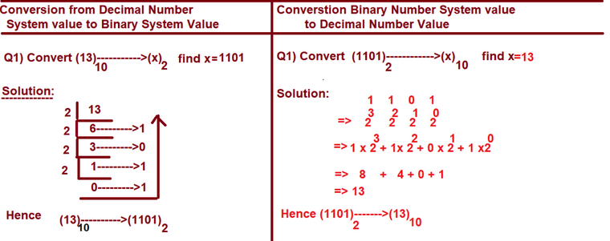

---

**Data Types in Python Programming**

- Fundamental data types
- int data type

The Purpose of Data Types in Python programming is that "To Allocate Sufficient Amount of Memory Space 	in Main Memory of the Computer for Storing Inputs"

In Python Programming, we have 14 Data Types and They are Classified into 6 Categories. They are

- **Fundamental  Category Data Types**

				1. int
				2. float
				3. bool
				4. complex
---

- **Sequential  Category Data Types**

				1. str
				2. bytes
				3. bytearray
				4. range

---

- **List  Category Data Types**

				1. list
				2. tuple

---

- **Set  Category Data Types**

				1. set
				2. frozenset

---

- **Dict  Category Data Types**

				1. dict

---

- **NoneType  Category Data Type**

				1. NoneType

