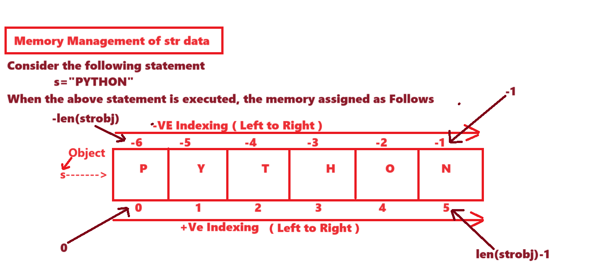

---
**Sequential  Category Data Types**
---

- The purpose of Sequential  Category Data Types is that " To Store Sequence of Values in single object ".
- We have 4 Data Types in Sequential  Category. They are

1. str
2. bytes
3. bytearray
4. range

---
**1. STR**
---

1. What is str
2. Definition of str
3. Notations of str
4. Types of strs
5. Syntax for storing str data
6. Memory Management of str data
	- +Ve Indexing
	- -Ve Indexing
7. Operations on str data
	- Indexing
	- Slicing Operation
		
**Programming Examples**

***Properties***

- 'str' is one of the pre-defined class and treated as Sequence Data Type.
- The purpose of str data type is that "To store String data or text data or Alphanumeric data or numeric data or special symbols  within double Quotes or single quotes or tripple double quotes and tripple single quotes. "


***Definition of str:***

- str is a collection of Characters or  Alphanumeric data or numeric data or any type of data enclosed within double Quotes or single quotes or tripple double quotes and tripple single quotes.


Types of Str data:----

In Python Programming, we have two types of Str Data. They are

1. Single Line String Data
2. Multi Line String Data


**1. Single Line String Data:**

Syntax1:-

varname=" Single Line String Data"

(OR)

Syntax2:-

varname=' Single Line String Data'

With the help double Quotes ("  ") and single Quotes (' ') we can store single line str data only but not possible to store multi line string data.

**2. Multi Line String Data:**

Syntax1:-
varname=" " "String Data1 
String Data2
String data-n 
" " "

(OR)

Syntax2:-

varname=' ' ' String Data1 
String Data2
String data-n ' ' '

With the help tripple double Quotes (" " "     " " ") and Tripple single Quotes (' ' '    ' ' ') we can store single line str data and multi line string data.

Examples:
```
>>> s1="Python"
>>> print(s1,type(s1))---------------------------Python <class 'str'>
>>> s2='Python'
>>> print(s2,type(s2))--------------------------Python <class 'str'>
>>> s3="A"
>>> print(s3,type(s3))--------------------------A <class 'str'>
>>> s4='A'
>>> print(s4,type(s4))-------------------------A <class 'str'>
>>> s1="123456"
>>> print(s1,type(s1))-------------------------123456 <class 'str'>
>>> s2="Python3.11"
>>> print(s2,type(s2))------------------------Python3.11 <class 'str'>
>>> s3="123$456_abc"
>>> print(s3,type(s3))------------------------123$456_abc <class 'str'>
>>> s4="@#$%^&8912"
>>> print(s4,type(s4))-------------------------@#$%^&8912 <class 'str'>
>>> s1="Python Programming"
>>> print(s1,type(s1))-----------------------Python Programming <class 'str'>

>>> addr1="Guido Van Rossum
                    ------------------------------    SyntaxError: unterminated string literal (detected at line 1)
>>> addr1='Guido Van Rossum
		 ---------------------------------   SyntaxError: unterminated string literal (detected at line 1)

>>> addr1=" " "Guido Van Rossum
... FNO:3-4, Hill Side
... Python Software Foundation
... Nether Lands-56 " " "
>>> print(addr1,type(addr1))
				Guido Van Rossum
				FNO:3-4, Hill Side
				Python Software Foundation
				Nether Lands-56 <class 'str'>

>>> addr2= ' ' ' Travis Oliphant
... HNO:12-34, Sea Side
... Numpy Organization
... Nether lands-58 ' ' '
>>> print(addr2,type(addr2))
				Travis Oliphant
				HNO:12-34, Sea Side
				Numpy Organization
				Nether lands-58 <class 'str'>

>>> s1="""Python Programming"""
>>> print(s1,type(s1))------------Python Programming <class 'str'>
>>> s1='''Python Programming'''
>>> print(s1,type(s1))-------------------Python Programming <class 'str'>
>>> s2="""A"""
>>> print(s2,type(s2))------------------A <class 'str'>
>>> s2='''A'''
>>> print(s2,type(s2))---------------A <class 'str'>
```

---


---
**Operations on str data**
---

On str Data, we can Perform Two Types of Operations. They are

1. Indexing Operation
2. Slicing  Operation

**1. Indexing Operation**

- The Purpose of Indexing Operation is that "To get OR Retrive or Exract One Value at a time from str object ".
- In Otherwords, the Process of Obtaining One Value at a time from given str object is called Indexing Operation.

**Syntax:    strobj[ Index ]**

Here strobj is an object of <class,'str'>
Here Index can be either +Ve or -Ve

If we enter Valid Index then we get Corresponding Value from that Index of str object.
If we enter Invalid Index then we get IndexError.

**Examples**

```
>>> s="PYTHON"
>>> print(s,type(s))---------------PYTHON <class 'str'>
>>>
>>> s[0]------------------------'P'
>>> s[5]------------------------'N'
>>> s[2]------------------------'T'
>>> s[3]-------------------------'H'
>>> s[4]------------------------'O'
>>> s[-1]------------------------'N'
>>> s[-6]------------------------'P'
>>> s[-5]-------------------------'Y'
>>> s[-2]-------------------------'O'
>>> s[-3]------------------------'H'
>>> s[-4]-------------------------'T'
>>> s[10]------------------------IndexError: string index out of range
>>> s[-11]------------------------IndexError: string index out of range

>>> s="Java Programming lang"
>>> print(s)------------------------Java Programming lang

>>> s[0]-------------------'J'
>>> s[-len(s)]------------'J'
>>> s[-1]-------------------'g'
>>> s[len(s)-1]------------'g'
```

---

**2. Slicing  Operation--Most Imp**

- The purpose of Slicing  Operation is that "To get range of values / Sub string from Given Main String object".
- In Otherwords, The process of Obtaining  range of values / Sub string from Given Main String object is called Slicing Operation.

In Python Programming, we have 5 Syntaxes for Performing Slicing Operation.

**Syntax-1:    strobj[BEGIN:END]**

Here strobj is an object of <class, 'str'>
Here BEGIN and END Represents either +Ve Index and -Ve Index
This Syntax Obtains range of Values OR Sub String from BEGIN Index to END-1 Index provided BEGIN Index < END Index Otherwise we get Space OR ' ' as Result.

**Examples**

```

>>> s="PYTHON"
>>> print(s,type(s))---------------PYTHON <class 'str'>
>>> s[0:4]----------------------------'PYTH'
>>> s[4:0]-----------------------------' '
>>> print(s[4:0])--------------------Space as Result
>>> s[0:3]----------------------------'PYT'
>>> s[2:6]----------------------------'THON'
>>> s[1:5]----------------------------'YTHO'
>>> s[3:6]----------------------------'HON'
>>> s[4:1]----------------------------' '
>>> s[1:6]----------------------------'YTHON'
>>> s[0:6]----------------------------'PYTHON'
>>> s[4:6]----------------------------'ON'

>>> s="PYTHON"
>>> print(s)---------------------PYTHON
>>> s[-6:-2]---------------------'PYTH'
>>> s[-5:-1]---------------------'YTHO'
>>> s[-1:-5]----------------------' '
>>> s[-5:-3]----------------------'YT'
>>> s[-6:-4]----------------------'PY'
>>> s[-3:-1]----------------------'HO'
>>> s[-4:-1]----------------------'THO'

```
#
Special Sub Points
#

```
>>> s="PYTHON"
>>> print(s)--------------PYTHON
>>> s[0:-4]---------------'PY'
>>> s[2:-1]---------------'THO'
>>> s[1:-4]---------------'Y'
>>> s[0:-1]---------------'PYTHO'
>>> s[3:-5]---------------''
>>> s[2:-1]---------------'THO'
>>> s[2:-3]----------------'T'
>>> s[2:-4]----------------''
>>> s[0:-2]----------------'PYTH'

>>> s="PYTHON"
>>> print(s)----------------PYTHON
>>> s[-6:4]-----------------'PYTH'
>>> s[-4:5]-----------------'THO'
>>> s[-5:5]-----------------'YTHO'
>>> s[-6:6]-----------------'PYTHON'
>>> s[-3:5]-----------------'HO'
>>> s[-2:4]-----------------''
>>> s[-2:5]-----------------'O'
>>> s[-5:2]-----------------'Y'
>>> s[-6:1]------------------'P'
>>> s[-len(s) : len(s)]-----'PYTHON'

```

#
Most Special Sub Points
#

```
>>> s="PYTHON"
>>> s[0:140]-----------------------'PYTHON'
>>> s[2:200]-----------------------'THON'
>>> s[1:180]-----------------------'YTHON'
>>> s[3:200]-----------------------'HON'
-----------------------------
>>> s="PYTHON"
>>> s[-100:-2]---------------------'PYTH'
>>> s[-30:-6]-----------------------''
>>> s[6:100]-----------------------''
>>> s[-20:-5]----------------------'P'
>>> s[-15:-1]-----------------------'PYTHO'

>>> s="PYTHON"
>>> print(s)---------------------------PYTHON
>>> s[-100:100]----------------------'PYTHON'
>>> s[100:-100]----------------------''
>>> s[-100:0]-------------------------''
>>> s[-100:1]-------------------------'P'
>>> s[-1000:7]------------------------'PYTHON'
>>> s[200:-len(s)]-------------------''
>>> s[0b0101:0b1010]-------------'N'
>>> s[False:True]-------------------'P'
>>> s[-6:0]-----------------------------''

```

**Syntax-2 : strobj[BEGIN :  ]**

In this Syntax, we specified BEGIN Index and did't Specify END Index.
If we don't Specify END Index then PVM Takes END Index as len(strobj)
					OR
If we don't Specify END Index then PVM Takes upto Last Character.
Hence This Syntax Obtains the Range of Values from Specified BEGIN Index to Last Character

**Examples**

```
>>> s="PYTHON"
>>> print(s)---------------PYTHON
>>> s[2:]------------------'THON'
>>> s[4:]------------------'ON'
>>> s[3:]------------------'HON'
>>> s[1:]------------------'YTHON'
>>> s[0:]------------------'PYTHON'
>>> s[5:]------------------'N'

>>> s="PYTHON"
>>> print(s)--------------PYTHON
>>> s[-4:]-----------------'THON'
>>> s[-6:]-----------------'PYTHON'
>>> s[-3:]-----------------'HON'
>>> s[-1]------------------'N'
>>> s[-2:]-----------------'ON'
>>> s[-5:]-----------------'YTHON'
>>> s[-len(s):]------------'PYTHON'
>>> s[-100:]---------------'PYTHON'
>>> s[-10:]-----------------'PYTHON'

```


**Syntax-3 : strobj[ : END]**

In this Syntax, we specified  END Index and did't Specify   BEGIN Index.
If we don't Specify BEGIN Index then PVM Takes BEGIN  Index as 0 (+Ve)  OR  -len(strobj) (-VE )
					OR
If we don't Specify BEGIN Index then PVM Takes From First Character.
Hence This Syntax Obtains the Range of Values from  First Character  to Specified END-1 Index


**Examples**

```
>>> s="PYTHON"
>>> print(s)----------------------------PYTHON
>>> s[:3]--------------------------------'PYT'
>>> s[:6]--------------------------------'PYTHON'
>>> s[:2]--------------------------------'PY'
>>> s[:5]--------------------------------'PYTHO'
>>> s[:4]--------------------------------'PYTH'
>>> s[:1]--------------------------------'P'
>>> s[:0]--------------------------------''

>>> s="PYTHON"
>>> print(s)------------------PYTHON
>>> s[:-3]---------------------'PYT'
>>> s[:-2]---------------------'PYTH'
>>> s[:-1]---------------------'PYTHO'
>>> s[:-4]---------------------'PY'
>>> s[:-5]---------------------'P'
>>> s[:-6]----------------------' '
>>> s[:-7]---------------------''
>>> s[:-177]-----------------''

```


**Syntax-4:   strobj[ : ]**

In this Syntax, we did't specify BEGIN and END Index.

When we don't specify BEGIN and END Index then PVM Takes BEGIN INDEX as 0(+VE) OR -len(strobj) (-VE)  and END Index as len(strobj) (+VE)  OR  -1 (-VE ).

OR

This Syntax Obtains Range of Values from First Character to Last Character (Complete Str Obj Data ).


**Examples**

```
>>> s="PYTHON"
>>> print(s)-----------PYTHON
>>> s[:]----------------'PYTHON'
>>> s[0:]---------------'PYTHON'
>>> s[-120:]----------'PYTHON'
>>> s[:100]------------'PYTHON'
>>> s[0:6]--------------'PYTHON'

>>> "MISSISSIPPI"[0:4]-------------'MISS'
>>> "MISSISSIPPI"[-4:]--------------'IPPI'
>>> "MISSISSIPPI"[:]-----------------'MISSISSIPPI'

```

**NOTE:**
All the Above Syntaxes are Getting the Range of Values from str object in FORWARD Direction with +1 Step


**Syntax-5:  strobj[BEGIN:END:STEP]**

RULE-1:
Here the values of BEGIN,END and STEP can be +VE or -VE


RULE-2:
If the value of STEP is +VE then PVM Gets range of values from BEGIN  Index to END-1 Index in FORWARD DIRECTION provided BEGIN < END Otherwise we get Space or ' ' as Result


RULE-3:
If the value of STEP is -VE then PVM Gets range of values from BEGIN  Index to END+1 Index in BACKWARD Direction Provided BEGIN>END Otherwise we get Space or ' ' as Result


RULE-4:
When we Extarct Range of Values in FORWARD DIRECTION and if specify END Index as 0 then we get Space OR ' ' as Result


RULE-5:
When we Extarct Range of Values in BACKWARD DIRECTION and if specify END Index as-1 then we get Space  OR ' ' as Result


**Examples--RULE-2**

```
>>> s="PYTHON"
>>> print(s)------------------PYTHON
>>> s[0:6]---------------------'PYTHON'
>>> s[0:6:1]------------------'PYTHON'
>>> s[0:6:2]-----------------'PTO'
>>> s[2:6:2]-----------------'TO'
>>> s[1:5:2]-----------------'YH'
>>> s[2:6:3]-----------------'TN'
>>> s[1:6:3]-----------------'YO'
>>> s[1:5:4]----------------'Y'
>>> s="PYTHON"
>>> print(s)--------------PYTHON
>>> s[4:2:1]--------------''

>>> s="PYTHON"
>>> print(s)--------------------PYTHON
>>> s[-6:-1:3]------------------'PH'
>>> s[-6:-1:2]------------------'PTO'
>>> s[-5:-1:3]------------------'YO'
>>> s[-3:-6:1]------------------''
>>> s[-6:-1:4]------------------'PO'

>>> s="PYTHON"
>>> print(s)-----------------PYTHON
>>> s[::]---------------------'PYTHON'
>>> s[:]----------------------'PYTHON'
>>> s[::1]--------------------'PYTHON'
>>> s[::2]--------------------'PTO'
>>> s[::3]--------------------'PH'
>>> s[::4]---------------------'PO'
>>> s[::40]------------------'P'

>>> s="PYTHON"
>>> print(s)--------------PYTHON
>>> s[2::2]---------------'TO'
>>> s[3::3]---------------'H'
>>> s[1::4]---------------'YN'
>>> s[2::]----------------'THON'
>>> s[-6::2]-------------'PTO'
>>> s[-4::1]-------------'THON'
>>> s[-3::3]--------------'H'

```


**Examples---Rule-3**

```
>>> s="PYTHON"
>>> print(s)---------------------PYTHON
>>> s[4:0:-1]--------------------'OHTY'
>>> s[5:2:-1]--------------------'NOH'
>>> s[5:1:-1]--------------------'NOHT'
>>> s[5:3:-1]--------------------'NO'
>>> s[5:2:-2]--------------------'NH'
>>> s[5:0:-3]--------------------'NT'
>>> s[4:0:-2]--------------------'OT'

>>> s="PYTHON"
>>> print(s)---------------------PYTHON
>>> s[-6:-1:-2]-----------------''
>>> s[-1:-6:-1]----------------'NOHTY'
>>> s[-1:-6:-2]----------------'NHY'
>>> s[-2:-7:-2]----------------'OTP'
>>> s[-2:-20:-2]---------------'OTP'
>>> s[-1:-4:-3]----------------'N'
>>> s[::-1]---------------------'NOHTYP'

```


**Examples--Rule-4**

```
>>> s="PYTHON"
>>> print(s)----------------PYTHON
>>> s[:0:1]-----------------''
>>> s[:0:2]-----------------''
>>> s[:0:3]-----------------''

```


**Examples--Rule-5**

```
>>> s="PYTHON"
>>> print(s)-------------PYTHON
>>> s[:-1:-1]------------''
>>> s[:-1:-2]------------''
>>> s[:-1:-3]------------''

```

**Special POINTS**


```
>>> s="MADAM"
>>> print(s)------------------------------MADAM
>>> s[::1]==s[::-1]---------------------True
>>> s="LIRIL"
>>> s[::1]==s[::-1]---------------------True
>>> s="RACECAR"
>>> s[::1]==s[::-1]---------------------True
>>> s="MOM"
>>> s[::1]==s[::-1]---------------------True
>>> s="DAD"
>>> s[::1]==s[::-1]--------------------True
>>> s="MALAYALAM"
>>> s[::1]==s[::-1]--------------------True
>>> s="RADAR"
>>> s[::1]==s[::-1]------------------True
>>> s="WOW"
>>> s[::1]==s[::-1]-------------------True
>>> s="PYTHON"
>>> s[::1]==s[::-1]------------------False
>>> s="JAVA"
>>> s[::1]==s[::-1]-----------------False
>>> s="1221"
>>> s[::1]==s[::-1]-----------------True

```

---
**Types Casting Techniques in Python**
---

The purpose of Types Casting Techniques in Python is that "To convert One type of Value into another Possible Type of Value".

In Python Programing, we have 5 Fundamental Type Casting Techniques. They are as follow:-

1. int()
2. float()
3. bool()
4. complex()
5. str()

---
**1. int()**
---

int() used for Converting One Possible Type of Value into int type value.

Syntax:    varname=int(float / bool / complex / str)


**Examples-1: 'float' type  into  'int' type---POSSIBLE**

```
>>> a=12.34
>>> print(a,type(a))---------------12.34 <class 'float'>
>>> b=int(a)
>>> print(b,type(b))---------------12 <class 'int'>
>>> x=int(2.33333)
>>> print(x,type(x))---------------2 <class 'int'>

```


**Examples-2: bool type  into  int type---POSSIBLE**

```
>>> a=True
>>> print(a,type(a))-----------True <class 'bool'>
>>> b=int(a)
>>> print(b,type(b))-----------1 <class 'int'>
>>> b=int(False)
>>> print(b,type(b))-----------0 <class 'int'>

```


**Examples-3: complex type  into  int type--NOT POSSIBLE**

```
>>> a=2+3j
>>> print(a,type(a))-----------(2+3j) <class 'complex'>
>>> b=int(a)---------------------TypeError: int() argument must be a string

```


**Examples-4:**

Case-1:   str int   into   int type -- POSSIBLE

```
>>> a="12"
>>> print(a,type(a))-------------12 <class 'str'>
>>> b=int(a)
>>> print(b,type(b))------------12 <class 'int'>
>>>
>>> b=int("123")
>>> print(b,type(b))------------123 <class 'int'>

```


Case-2:   str float   into   int type---NOT POSSIBLE

```
>>> a="12.34"
>>> print(a,type(a))----------12.34 <class 'str'>
>>> b=int(a)--------------------ValueError: invalid literal for int() with base 10: '12.34'

```


Case-3:   str bool   into   int type--NOT POSSIBLE

```
>>> a="True"
>>> print(a,type(a))-----------True <class 'str'>
>>> b=int(a)---------------------ValueError: invalid literal for int() with base 10: 'True'

```


Case-4:   str complex  into   int type--NOT POSSIBLE

```
>>> a="2+3.5j"
>>> print(a,type(a))-------------2+3.5j <class 'str'>
>>> b=int(a)-----------------------ValueError: invalid literal for int() with base 10: '2+3.5j'

```


Case-5:   Pure str  into   int type

```
>>> a="PYTHON"
>>> print(a,type(a))-------------PYTHON <class 'str'>
>>> b=int(a)----------------------ValueError: invalid literal for int() with base 10: 'PYTHON'

```

---
**2. float()**
---

float() used for Converting One Possible Type of Value into float type value.

**Syntax:    varname=float(int / bool / complex / str )**


**Examples-1: int type  into  float type---POSSIBLE**

```
>>> a=12
>>> print(a,type(a))------------12 <class 'int'>
>>> b=float(a)
>>> print(b,type(b))-----------12.0 <class 'float'>
>>> b=float(0)
>>> print(b,type(b))----------0.0 <class 'float'>

```


**Examples-2: bool type  into float type**

```
>>> a=True
>>> print(a,type(a))-------------True <class 'bool'>
>>> b=float(a)
>>> print(b,type(b))-------------1.0 <class 'float'>
>>> b=float(False)
>>> print(b,type(b))-------------0.0 <class 'float'>

```


**Examples-3: complex type  into  float type--NOT POSSIBLE**

```

>>> a=2+3j
>>> print(a,type(a))--------(2+3j) <class 'complex'>
>>> b=float(a)----------TypeError: float() argument must be a string

>>> b=float(12+34j.real)
>>> print(b)--------------12.0
>>> b=float((12+34j).real)
>>> print(b)-------------12.0
>>> b=float((12+34j).imag)
>>> print(b)------------34.0
>>> b=float(12+34j.imag)
>>> print(b)----------46.0 (12.0+34.0)

```


**Examples-4: str type  into  float type**

**Case-1:   str int   into   float type**

```
>>> a="12"
>>> print(a,type(a))---------12 <class 'str'>
>>> b=float(a)
>>> print(b,type(b))----------12.0 <class 'float'>
>>> b=float("123")
>>> print(b,type(b))---------123.0 <class 'float'>

```


**Case-2:   str float   into   float type--POSSIBLE**

```
>>> a="12.34"
>>> print(a,type(a))------------12.34 <class 'str'>
>>> b=float(a)
>>> print(b,type(b))------------12.34 <class 'float'>

>>> b=float("127.0.0.1")-----------ValueError: could not convert string to float: '127.0.0.1'

```


**Case-3:   str bool   into   float type--NOT POSSIBLE**

```

>>> a="True"
>>> print(a,type(a))---------------True <class 'str'>
>>> b=float(a)----------------------ValueError: could not convert string to float: 'True'

```


**Case-4:   str complex  into   float type--NOT POSSIBLE**

```
>>> a="2+3j"
>>> print(a,type(a))-----------2+3j <class 'str'>
>>> b=float(a)------------------ValueError: could not convert string to float: '2+3j'

```


**Case-5:   Pure str  into   float type--NOT POSSIBLE**

```
>>> a="PYTHON3.12"
>>> print(a,type(a))------------PYTHON3.12 <class 'str'>
>>> b=float(a)-----------------ValueError: could not convert string to float: 'PYTHON3.12'

>>> x=float(a[-4:])
>>> print(x,type(x))---------3.12 <class 'float'>
>>> x=float(a[-4:-3])
>>> print(x,type(x))-----------3.0 <class 'float'>

```


---
**3. bool()**
---

bool() is Converting One Possible Type of Value into bool type value

Syntax:    varname=bool(int / float / complex /str)

ALL NON-ZERO VALUES ARE TREATED AS TRUE.
ALL ZERO VALUES ARE TREATED AS FALSE.


When we come across str data and need to convert into bool type then we must consider length of str. If length of str is 0 then It is False and if length of str is not zero then It is True.


**Examples-1: int type  into bool type---POSSIBLE**

```
>>> a=10
>>> print(a,type(a))-------------10 <class 'int'>
>>> b=bool(a)
>>> print(b,type(b))-------------True <class 'bool'>
>>> a=-12
>>> print(a,type(a))------------- -12 <class 'int'>
>>> b=bool(a)
>>> print(b,type(b))------------- True <class 'bool'>
>>> a=0
>>> print(a,type(a))------------- 0 <class 'int'>
>>> b=bool(a)
>>> print(b,type(b))------------- False <class 'bool'>

```


**Examples-2: float type  into bool type-----POSSIBLE**

```

>>> a=1.2
>>> print(a,type(a))------------1.2 <class 'float'>
>>> b=bool(a)
>>> print(b,type(b))------------True <class 'bool'>
>>> a=0.0
>>> print(a,type(a))-------------0.0 <class 'float'>
>>> b=bool(a)
>>> print(b,type(b))-------------False <class 'bool'>
>>> a=0.0000000000000000000000000000000000000000000000000001
>>> print(a,type(a))------------1e-52 <class 'float'>
>>> b=bool(a)
>>> print(b,type(b))------------True <class 'bool'>

```


**Examples-3: complex type  into  bool type---POSSIBLE**

```

>>> a=2+3j
>>> print(a,type(a))--------------(2+3j) <class 'complex'>
>>> b=bool(a)
>>> print(b,type(b))--------------True <class 'bool'>
>>> a=0+0j
>>> print(a,type(a))--------------0j <class 'complex'>
>>> b=bool(a)
>>> print(b,type(b))-------------False <class 'bool'>
>>> a=0+3j
>>> print(a,type(a))-------------3j <class 'complex'>
>>> b=bool(a)
>>> print(b,type(b))------------True <class 'bool'>

```


**Examples-4: str type  into  bool type**


**Case-1:   str int   into   bool type**


```
>>> a="123"
>>> print(a,type(a))-----------------123 <class 'str'>
>>> b=bool(a)
>>> print(b,type(b))-----------------True <class 'bool'>
>>> a="0"
>>> print(a,type(a))------------------0 <class 'str'>
>>> b=bool(a)
>>> print(b,type(b))-----------------True <class 'bool'>
>>> len(a)------------------------------1
>>> b=bool("0")
>>> print(b,type(b))------------------True <class 'bool'>
```


**Case-2:   str float   into   bool type------POSSIBLE**

```
>>> a="1.2"
>>> print(a,type(a))----1.2 <class 'str'>
>>> b=bool(a)
>>> print(b,type(b))-------True <class 'bool'>
>>> len(a)------------------3
>>> a="0.0"
>>> print(a,type(a))---------0.0 <class 'str'>
>>> b=bool(a)
>>> print(b,type(b))---------True <class 'bool'>
>>> b=bool(float("0.0"))
>>> print(b)------------False
>>> b=bool(int("0.1"))-----------ValueError: invalid literal for int() with base 10: '0.1'

```


**Case-3:   str bool   into  bool type---POSSIBLE**

```
>>> a="False"
>>> print(a,type(a))---------------False <class 'str'>
>>> b=bool(a)
>>> print(b,type(b))--------------True <class 'bool'>
>>> a="True"
>>> print(a,type(a))--------------True <class 'str'>
>>> b=bool(a)
>>> print(b,type(b))--------------True <class 'bool'>
```


**Case-4:   str complex  into   bool  type-----POSSIBLE**

```
>>> a="2+5.6j"
>>> print(a,type(a))---------------2+5.6j <class 'str'>
>>> b=bool(a)
>>> print(b,type(b))---------------True <class 'bool'>
>>> a="0+0j"
>>> print(a,type(a))---------------0+0j <class 'str'>
>>> b=bool(a)
>>> print(b,type(b))---------------True <class 'bool'>
>>> b=bool(float(2+0j.imag))
>>> print(b)--------------------------True
>>> b=bool(float((2+0j).imag))
>>> print(b)--------------------------False

```


**Case-5:   Pure str  into   bool type------POSSIBLE**

```
>>> a="PYTHON"
>>> print(a,type(a))------------PYTHON <class 'str'>
>>> b=bool(a)
>>> print(b,type(b))-----------True <class 'bool'>
>>> a=""
>>> print(a,type(a))---------- Space   <class 'str'>
>>> b=bool(a)
>>> print(b,type(b))----------False <class 'bool'>
>>> len(a)-----------------------0
>>> print(bool(""))-------------False
```


---
**4. complex()**
---


complex() is used for Converting  One Possible Type of Value into complex type value.

Syntax:      varname=complex(int / float / bool / str)


**Examples-1: int type  into complex type---POSSIBLE**

```
>>> a=12
>>> print(a,type(a))-------------12 <class 'int'>
>>> b=complex(a)
>>> print(b,type(b))------------(12+0j) <class 'complex'>
>>> a=0
>>> print(a,type(a))-------------0 <class 'int'>
>>> b=complex(a)
>>> print(b,type(b))-------------0j <class 'complex'>
>>> b=complex(-12)
>>> print(b,type(b))-------------(-12+0j) <class 'complex'>
```

**Examples-2: float type  into complex type---POSSIBLE**

```
>>> a=1.2
>>> print(a,type(a))---------1.2 <class 'float'>
>>> b=complex(a)
>>> print(b,type(b))---------(1.2+0j) <class 'complex'>
```


**Examples-3: bool type  into  complex type-----POSSIBLE**

```
>>> a=True
>>> print(a,type(a))---------------True <class 'bool'>
>>> b=complex(a)
>>> print(b,type(b))---------------(1+0j) <class 'complex'>
>>> a=False
>>> print(a,type(a))---------------False <class 'bool'>
>>> b=complex(a)
>>> print(b,type(b))---------------0j <class 'complex'>
```


**Examples-4: str type  into  complex type**

**Case-1:   str int   into   complex type--POSSIBLE**

```
>>> a="10"
>>> print(a,type(a))-------------10 <class 'str'>
>>> b=complex(a)
>>> print(b,type(b))------------(10+0j) <class 'complex'>
>>> a="0"
>>> print(a,type(a))------------0 <class 'str'>
>>> b=complex(a)
>>> print(b,type(b))-----------0j <class 'complex'>
```


**Case-2:   str float   into   complex type---POSSIBLE**

```
>>> a="2.3"
>>> print(a,type(a))---------------2.3 <class 'str'>
>>> b=complex(a)
>>> print(b,type(b))--------------(2.3+0j) <class 'complex'>
```


**Case-3:   str bool   into  complex type--NOT POSSIBLE**

```
>>> a="True"
>>> print(a,type(a))------------True <class 'str'>
>>> b=complex(a)--------------ValueError: complex() arg is a malformed string
```


**Case-4:   str complex  into  complex  type--POSSIBLE**

```
>>> a="2+3j"
>>> print(a,type(a))-------------2+3j <class 'str'>
>>> b=complex(a)
>>> print(b,type(b))------------(2+3j) <class 'complex'>
>>> a="2+3J"
>>> print(a,type(a))------------2+3J <class 'str'>
>>> b=complex(a)
>>> print(b,type(b))------------(2+3j) <class 'complex'>
>>> a="2+3i"
>>> print(a,type(a))------------2+3i <class 'str'>
>>> b=complex(a)--------------ValueError: complex() arg is a malformed string
```


**Case-5:   Pure str  into   compelx type----NOT POSSIBLE**

```
>>> a="PYTHON"
>>> print(a,type(a))---------------PYTHON <class 'str'>
>>> b=complex(a)----------------ValueError: complex() arg is a malformed string
```

**NOTE:**

```
>>>a=10
>>>b=20
>>> c=complex(str(a)+"+"+str(b)+"j")
>>> print(c,type(c))------------------------(10+20j) <class 'complex'>
			OR
>>> d=complex("10"+"-"+"12"+"j")
>>> print(d)--------------------------(10-12j)
```

---
**5. str()**
---

str() converts all types of values into str type.

Syntax:   varname=str(int / float / bool / complex)

**Examples**

```

>>> a=12
>>> print(a,type(a))---------------12 <class 'int'>
>>> b=str(a)
>>> print(b,type(b))---------------12 <class 'str'>
>>> b-----------------------------------'12'

>>> a=1.2
>>> print(a,type(a))-------------1.2 <class 'float'>
>>> b=str(a)
>>> print(b,type(b))-------------1.2 <class 'str'>
>>> b-------------------------------'1.2'

>>> a=True
>>> print(a,type(a))-------------True <class 'bool'>
>>> b=str(a)
>>> print(b,type(b))------------True <class 'str'>
>>> b-------------------------------'True'

>>> a=2+3j
>>> print(a,type(a))------------(2+3j) <class 'complex'>
>>> b=str(a)
>>> print(b,type(b))------------(2+3j) <class 'str'>
>>> b-------------------------------'(2+3j)'
```


---
**bytes data type and Mutable and Immutable Objects**
---

---
**2. bytes**
---


'bytes' is one of the pre-defined class and treated as Sequence Data Type.

The purpose of bytes data type is that "To Implement End-to-End Encryption for obtaining the Security to the Data in Digital World"

To Implement End-to-End Encryption by using bytes data type by organizing OR Using the Range of Values from 0 to 256 i.e It store the range of values 0 to 256-1(0,255).

In Python Programming, we don't have any Symbolic Notation  for Storing bytes data bcoz Python Programmer never Stores bytes data in the program (But It is Just Convertion format) Directly. But we convert Other type of Values into bytes type by using bytes().

**Syntax:      varname=bytes(Iterable-Object) # Iterable objects are those which contains more than one value.**


An Object of bytes maintains INSERTION ORDER (Nothing but whatever the Order we insert the data, In the Same Order the data will be displayed )

On the Object of bytes, we can perform Both Indexing and  Slicing Operations.
An Object of bytes belongs to IMMUTABLE bcoz 'bytes' object does not support item assignment


**Examples**

```

>>> lst=[10,20,40,0,256,22,67]
>>> print(lst,type(lst))------------------[10, 20, 40, 0, 256, 22, 67] <class 'list'>
>>> b=bytes(lst)--------------------------ValueError: bytes must be in range(0, 256)

>>> lst=[10,20,-40,0,255,22,67]
>>> print(lst,type(lst))-----------------[10, 20, -40, 0, 255, 22, 67] <class 'list'>
>>> b=bytes(lst)-------------------------ValueError: bytes must be in range(0, 256)

>>> lst=[10,20,40,0,255,22,67]
>>> print(lst,type(lst))------------------[10, 20, 40, 0, 255, 22, 67] <class 'list'>
>>> b=bytes(lst)
>>> print(b,type(b))----------------------b'\n\x14(\x00\xff\x16C' <class 'bytes'>

>>> for v in b:
...		print(v)
...
				10
				20
				40
				0
				255
				22
				67


>>> lst=[10,20,40,0,255,22,67]
>>> print(lst,type(lst))-----------------[10, 20, 40, 0, 255, 22, 67] <class 'list'>
>>> b=bytes(lst)
>>> print(b,type(b))-------------------b'\n\x14(\x00\xff\x16C' <class 'bytes'>
>>> b[0]---------------------------------10
>>> b[-1]--------------------------------67
>>> b[1]---------------------------------20
>>> b[0:4]------------------------------b'\n\x14(\x00'
>>> for v in b[0:4]:
...		print(v)
...
			10
			20
			40
			0
>>> for v in b[::-1]:
...		print(v)
...
			67
			22
			255
			0
			40
			20
			10


>>> lst=[10,20,40,0,255,22,67]
>>> print(lst,type(lst))------------------[10, 20, 40, 0, 255, 22, 67] <class 'list'>
>>> b=bytes(lst)
>>> print(b,type(b))---------------------b'\n\x14(\x00\xff\x16C' <class 'bytes'>
>>> b[0]------------------------------------10
>>> b[0]=30-------------------------------TypeError: 'bytes' object does not support item assignment

```


**Mutable and Immutable Objects**

Mutable Object

=>A Mutable Object is one, whose Content can be Changed at Same Address.

Examples: list,set,dict

Immutable Object

An Immutable Object is one, which Satisfies the Following Properties

1. An Immutable Object content Can't Changed at Same Address
    (Immutable Object content Can be Changed and whose Modified Value Placed at Different Address)
2. An Immutable Object does not Support Item Assignment

Examples:  int, float,bool,complex,str,bytes,range,tuple,set,frozenset,NoneType


---
**bytearray data type and range data type**
---

---
**3. bytearray**
---

'bytearray' is one of the pre-defined class and treated as Sequence Data Type.

The purpose of bytearray data type is that "To Implement End-to-End Encryption for obtaining the Security to the Data in Digital World"

To Implement End-to-End Encryption by using bytearray data type by organizing OR Using the Range of Values from 

    0 to 256 i.e It store the range of values 0 to 256-1(0,255).

In Python Programming, we don't have any Symbolic Notation  for Storing bytearray data bcoz Python Programmer never Stores bytearray data in the program (But It is Just Convertion format) Directly. But we convert Other type of Values into bytearray type by using bytearray().

**Syntax:      varname=bytearray(Iterable-Object) # Iterable objects are those which contains more than one value.**


An Object of bytearray maintains INSERTION ORDER (Nothing but whatever the Order we insert the data, In the Same Order the data will be displayed )

On the Object of bytearray, we can perform Both Indexing and  Slicing Operations.

An Object of bytearray belongs to MUTABLE bcoz 'bytearray' object  supports item assignment


**NOTE:**
The Functionality of bytearray is exactly similar to bytes. But an Object of bytes belongs to IMMUTABLE where as an object of bytearray belongs to MUTABLE.

**Examples**

```
>>> lst=[10,20,35,0,65,256,100]
>>> print(lst,type(lst))------------------[10, 20, 35, 0, 65, 256, 100] <class 'list'>
>>> ba=bytearray(lst)-------------------ValueError: byte must be in range(0, 256)
>>> lst=[10,20,-35,0,65,255,100]
>>> print(lst,type(lst))-------------------[10, 20, -35, 0, 65, 255, 100] <class 'list'>
>>> ba=bytearray(lst)------------------ValueError: byte must be in range(0, 256)


>>> lst=[10,20,35,0,65,255,100]
>>> print(lst,type(lst))-------------[10, 20, 35, 0, 65, 255, 100] <class 'list'>
>>> ba=bytearray(lst)
>>> print(ba,type(ba))--------------bytearray(b'\n\x14#\x00A\xffd') <class 'bytearray'>
>>> for val in ba:
...		print(val)
...
			10
			20
			35
			0
			65
			255
			100
>>> for val in ba[2:5]:
...		print(val)
...
			35
			0
			65
>>>
>>> ba[0]----------------------------10
>>> ba[-1]---------------------------100
>>> for val in ba[::-1]:
...		print(val)
...
			100
			255
			65
			0
			35
			20
			10


>>> lst=[10,20,35,0,65,255,100]
>>> print(lst,type(lst))---------------[10, 20, 35, 0, 65, 255, 100] <class 'list'>
>>> ba=bytearray(lst)
>>> print(ba,type(ba),id(ba))------bytearray(b'\n\x14#\x00A\xffd') <class 'bytearray'> 1336139171184
>>> ba[0]----------------------------10
>>> ba[0]=125 # Item Assigment is Possible in the case of bytearray
>>> for val in ba:
...		print(val)
...
			125
			20
			35
			0
			65
			255
			100
>>> print(ba,type(ba),id(ba))-----bytearray(b'}\x14#\x00A\xffd') <class 'bytearray'> 1336139171184
------------------
>>> ba[1:3]=[150,155]  # Item Assigment is Possible in the case of bytearray
>>> for val in ba:
...		print(val)
...
		125
		150
		155
		0
		65
		255
		100
>>> print(ba,type(ba),id(ba))------bytearray(b'}\x96\x9b\x00A\xffd') <class 'bytearray'> 1336139171184

```

---
**4. range**
---


"range" is one of the pre-defined class and treated as Sequence data type.

The purpose of range data type is that "To Store sequence of numerical Integer values by maintaining equal Interval of Value(called Step) either in Forward OR in Backward Direction".

On the Object of range, we can perform Both Indexing and Slicing Operations.

An Object of range belongs to IMMUTABLE bcoz range object does not support Item Assigment

An Object of range maintains Insertion order.

To implements the purpose of range data type for Storing  sequence of numerical Integer values by maintaining equal Interval of Value(called Step) either in Forward OR in Backward Direction, we have 3 Syntaxes. They are


**Syntax-1:   varname=range(Value)**

This Syntax generates range of values from 0 to Value-1


**Examples**

```
>>> r=range(6)
>>> print(r,type(r))----------range(0, 6) <class 'range'>
>>> for v in r:
...		print(v)
...
			0
			1
			2
			3
			4
			5
>>> for val in range(6):
...		print(val)
...
			0
			1
			2
			3
			4
			5

```


**Syntax-2:   varname=range(Start,Stop)**

This Syntax generates range of values from Start to Stop-1 

**Examples**

```
>>> r=range(100,106)
>>> print(r,type(r))------------range(100, 106) <class 'range'>
>>> for v in r:
...		print(v)
...
		100
		101
		102
		103
		104
		105
>>> r[0]---------------100
>>> r[-1]--------------105
>>> r[0]=150---------TypeError: 'range' object does not support item assignment
>>> for val in range(100,106):
...		print(val)
...
		100
		101
		102
		103
		104
		105
>>> for val in range(100,106)[1:5]:
...		print(val)
...
		101
		102
		103
		104
>>> for val in range(100,106)[::2]:
...		print(val)
...
		100
		102
		104


```

**NOTE:**
The above Syntaxes generates range of values only in FORWARD Direction with default step +1


**Syntax-3:   varname=range(Start,Stop,Step)**

This Syntax generates range of values from start to stop by maintaining Equal Interval of Value In terms of Step Value either in FORWARD OR BACKWARD Direction.

**Examples**

```
>>> r=range(40,49,2)
>>> print(r,type(r))----------range(40, 49, 2) <class 'range'>
>>> for val in r:
...		print(val)
...
		40
		42
		44
		46
		48
>>> for val in range(40,50,2):
...		print(val)
...
		40
		42
		44
		46
		48
>>> for val in range(40,50,2)[::-1]:
...		print(val)
...
		48
		46
		44
		42
		40

```


**Examples Sheet**

**Q1) 0  1  2  3   4   5   6   7  8   9  10------rage(11)  OR  range(0,11) OR range(0,11,1)**

```
>>> for val in range(11):
...     print(val)
...
		0
		1
		2
		3
		4
		5
		6
		7
		8
		9
		10
>>> for val in range(0,11):
...		print(val)
...
		0
		1
		2
		3
		4
		5
		6
		7
		8
		9
		10
>>> for val in range(0,11,1):
...		print(val)
...
		0
		1
		2
		3
		4
		5
		6
		7
		8
		9
		10

```


**Q2) 10  11  12  13  14  15-----range(10,16)  OR  range(10,16,1)**

```
>>> for val in range(10,16):
...		print(val)
...
		10
		11
		12
		13
		14
		15
>>> for val in range(10,16,1):
...		print(val)
...
			10
			11
			12
			13
			14
			15
```


**Q3) -1 -2 -3 -4 -5 -6 -7 -8 -9 -10-----range(-1,-11,-1)**

```
>>> for val in range(-1,-11,-1):
...		print(val)
...
			-1
			-2
			-3
			-4
			-5
			-6
			-7
			-8
			-9
			-10

```

	

**Q4) 10  12  14  16  18  20--------range(10,21,2)**

```
>>> for val in range(10,21,2):
...		print(val)
...
			10
			12
			14
			16
			18
			20

```


**Q5) -10  -15 -20  -25 -30 -35 -40  -45 -50------range(-10,-51,-5)**

```
>>> for val in range(-10,-51,-5):
...		print(val)
...
			-10
			-15
			-20
			-25
			-30
			-35
			-40
			-45
			-50
>>> for val in range(-10,-55,-5):
...		print(val)
...
			-10
			-15
			-20
			-25
			-30
			-35
			-40
			-45
			-50

```


**Q6)  -10  -9  -8  -7  -6  -5 -4  -3 -2 -1-------range(-10,0,1) OR range(-10,0)**


```
>>> for val in range(-10,0,1):
...		print(val)
...
			-10
			-9
			-8
			-7
			-6
			-5
			-4
			-3
			-2
			-1
>>> for val in range(-10,0):
...		print(val)
...
			-10
			-9
			-8
			-7
			-6
			-5
			-4
			-3
			-2
			-1

```


**Q7) 50  40  30  20  10  0------range(50,-1,-10)**

```
>>> for val in range(50,-1,-10):
...		print(val)
...
		50
		40
		30
		20
		10
		0
>>> for val in range(50,-1,-10)[::-1]:
...		print(val)
...
		0
		10
		20
		30
		40
		50

```


**Q8)  -20  -15  -10  -5   0-------range(-20,1,5)**

```
>>> for val in range(-20,1,5):
...		print(val)
...
			-20
			-15
			-10
			-5
			0

```


**Q9) 1000  750  500 250  0---------range(1000,-1,-250)**


```
>>> for val in range(1000,-1,-250):
...		print(val)
...
		1000
		750
		500
		250
		0
NOTE:
		>>> for val in range(1000,-1,250):
...				print(val)  # No Output bcoz range is wrong
...

```


**Q10)  -5  -4  -3  -2  -1  0   1  2  3  4-----range(-5,5,1) OR range(-5,5)**

```

>>> for val in range(-5,5,1):
...		print(val)
...
			-5
			-4
			-3
			-2
			-1
			0
			1
			2
			3
			4
>>> for val in range(-5,5):
...		print(val)
...
		-5
		-4
		-3
		-2
		-1
		0
		1
		2
		3
		4
>>> for val in range(-5,5,1):
...		print(val,end=" ")
...
				-5 -4 -3 -2 -1 0 1 2 3 4 

```


```
>>> n=19
>>> for v in range(1,11):
...		print("{} x {} = {}".format(n,v,n*v))
...
		19 x 1 = 19
		19 x 2 = 38
		19 x 3 = 57
		19 x 4 = 76
		19 x 5 = 95
		19 x 6 = 114
		19 x 7 = 133
		19 x 8 = 152
		19 x 9 = 171
		19 x 10 = 190
```


**Examples of range**

```
Q1) 0  1  2  3   4   5   6   7  8   9  10

Q2) 10  11  12  13  14  15

Q3) -1 -2 -3 -4 -5 -6 -7 -8 -9 -10

Q4) 10  12  14  16  18  20

Q5) -10  -15 -20  -25 -30 -35 -40  -45 -50

Q6)  -10  -9  -8  -7  -6  -5 -4  -3 -2 -1

Q7) 50  40  30  20  10  0

Q8)  -20  -15  -10  -5   0

Q9) 1000  750  500 250  0

Q10)  -5  -4  -3  -2  -1  0   1  2  3  4
```