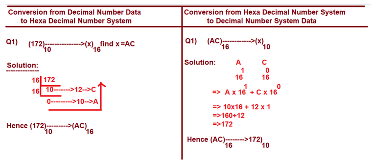

**Fundamental  Category Data Types**

- The purpose of Fundamental  Category Data Types is " To Store Single Value "

- This Fundamental  Category Data Types contains 4 Data Types. They are

1. int
2. float
3. bool
4. complex

---

***int* DATA TYPE**

'int' is one of the Pre-Defined Class and Treated as Fundamental Data Type

The purpose of int data type is that "To store Integer Data OR Whole Numbers OR Integral Values (Values without decimal Values) ".

Examples:

```
Python Instructions				                    Outputs
-----------------------------------		---------------------------
> a=10
> b=20
> c=a+b
> print(a,type(a))---------------------------10 <class 'int'>
> print(b,type(b))---------------------------20 <class 'int'>
> print(c,type(c))---------------------------30 <class 'int'>
> a=100
> print(a,type(a),id(a))--------------------100 <class 'int'> 140723586336280
```

By using int data type, we can Store Different Types of Number System Values.

In Computing,We have 4 Types of Number Systems. They are

1. Decimal Number System
2. Binary Number System
3. Octal Number System
4. Hexa Decimal Number System.

**1. Decimal Number System**

- Decimal Number System is the default number system followed by all Human Beings for their Day-to-Day Operations.

- The Decimal Number System contains the following'
		Digits: 0 1 2 3 4 5 6 7 8 9--------------Total : 10
		Base: 10

All Base 10 Literals are Called Decimal Number System values


Examples
```
> a=5
> b=6
> c=a*b
> print(a,b,c)---------------5 6 30
```

**2. Binary Number System**

- The Binary Number System understandable by OS and Processor
- Binary Number System contains the following
		Digits: 0  1  ----- Total :2
		Base :  2 
- All base 2 literals are called Binary Number System Values
- In Python Programming, Binary Number System Data must be stored by Preceded with a Letter "0b" or "0B".

**Syntax 1:

varname=0b Binary Data

OR

varname=0B Binary Data

Even though we store Binary data, Internally Python Execution Environment Converts Binary Data (Lowel Data) into Decimal Number Data.

Examples:

```
> a=0b1010
> print(a,type(a))--------------------10 <class 'int'>
-----------------
> a=0b1111
> print(a,type(a))---------------------15 <class 'int'>
> bin(10)-------------------------------'0b1010'
> bin(15)--------------------------------'0b1111'
> bin(21)--------------------------------'0b10101'
> a=0B10101
> print(a,type(a))---------------------21 <class 'int'>
> a=0b10102--------------------------SyntaxError: invalid digit '2' in binary literal
```

**3. Octal Number System**

- The Octal Number System understandable by Microprocessor Kits like 8086 (Microprocessor/Assembly Lang Prog).
- Octal  Number System contains the following
		Digits: 0  1 2 3 4 5 6 7  ----- Total :8
		Base :  8

- All base 8 literals are called Octal Number System Values.
- In Python Programming, Octal Number System Data must be stored by Preceded with a Letter "0o" or "0O".

**Syntax1:

varname=0o Octal Data

OR
varname=0O Octal Data

Even though we store Octal data, the Internally Python Execution environment Converts Octal Data (Lowel Data) into Decimal Number Data.

Examples:
```
> a=0o15
> print(a,type(a))------------------13 <class 'int'>
> a=0O17
> print(a,type(a))------------------15 <class 'int'>
> a=0o123
> print(a,type(a))-------------------83 <class 'int'>
> a=0O1201
> print(a,type(a))-------------------641 <class 'int'>
> a=0o128----------------------------SyntaxError: invalid digit '8' in octal literal
```

**4. Hexa Decimal Number System**

- The Hexa Decimal Number System used in Development of OSes ( Window,Linux,Unix,Solaris,Mac..etc )
- The Hexa Decimal Number System contains the following
		Digits: 0 1 2 3 4 5 6 7 8 9
			    A(10)  B(11) C(12) D(13) E(14) F(15)  (Both Upper and Lower--any one we can take)
		Base: 16

- All Base 16 Literals are Called  Hexa Decimal Number System values.
- In Python Programming, Hexa Decimal Number System Data must be stored by Preceded with a Letter "0x" or "0X".

**Syntax1:

varname=0x Hexa Decimal Data

OR

varname=0X Hexa Decimal Data

Even though we store Hexa Decimal Number  data, Internally Python Execution environment Converts Hexa Decimal Number  Data (Lowel Data) into Decimal Number Data.

Examples:

```
> a=0xa
> print(a,type(a))------------10 <class 'int'>

a=0xF
> print(a,type(a))-------------15 <class 'int'>
> a=0xAC
> print(a,type(a))-------------172 <class 'int'>

> a=0xBEE
> print(a,type(a))------------3054 <class 'int'>
> a=0xFaCe
> print(a,type(a))------------64206 <class 'int'>
> a=0xACC
> print(a,type(a))------------2764 <class 'int'>
> a=0xACCER----------------SyntaxError: invalid hexadecimal literal
```

**NOTE:**
```
> a=0369--------SyntaxError: leading zeros in decimal integer literals are not permitted
```


