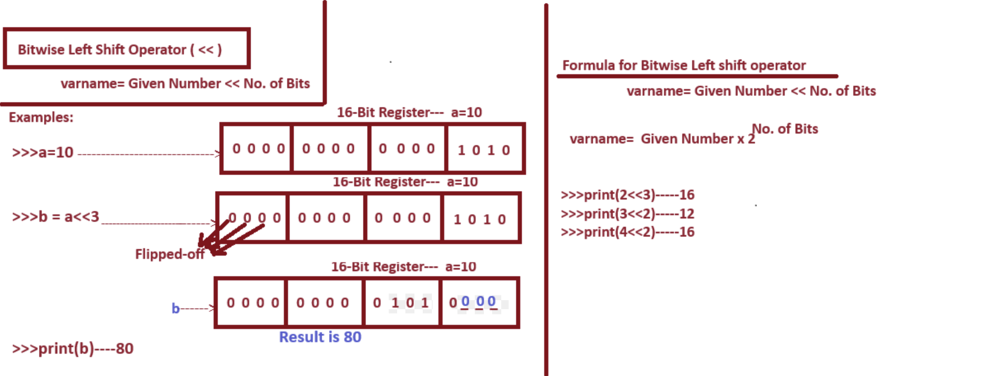

# 5. Bitwise Operators

=>The Purpose of Bitwise Operators is that "To Pefform Operations on Integer Data in the form of Bit by Bit."
=>The Bitwise Operators are applicable on Integer Values Only But not on floating point values bcoz Integer Values 
    provides Certanity where as floating point values does not provide Certanity.
=>The Execution Process of Bitwise Operators is shown Bellow.
		Step-1: Bitwise Operators Converts Integer Data into Binary Data.
		Step-2: Bitwise Operators Performs the Bitwise Operation on Binary Data in the form of Bit by Bit and 
		             generates Result and It is Internally Available in the form of Binary.
		Step-3: Since Python Programming Lang is High Level, PVM Displays the Result of Binary Operations
			    in the form of Decimal Number System (User Understandable format).
=>Since Bitwise Operators are Internally Performing the Operations in the Bit by Bit and They hence They named as 
    Bitwise Operators.
=>In Python Programming Language, We have 6 Types of Bitwise Operators. They Given in the following Table.
*************************************************************************************************************************************************
			SLNO		SYMBOL			MEANING
*************************************************************************************************************************************************
			1.			<<				Bitwise Left Shift Operator
			2.			>>				Bitwise Right Shift Operator
			3.			|				Bitwise OR Operator
			4.			&				Bitwise AND Operator
			5.			~				Bitwise Complement Operator
			6.			^				Bitwise XOR Operator
*************************************************************************************************************************************

### 1. Bitwise Left Shift Operator ( << )

Syntax:	varname = Given Number << No. of Bits
--------------------
Explanation:
--------------------
The Execution Process of Bitwise LeftShift Operator ( << ) is that "It Moves Number of Bits Towards Left Side By Adding Number of Zeros (Number of Zeros=Depending No. Of bits we Flipped-off) at Right Side.
-------------------------------
Examples
-------------------------------
>>> a=10
>>> b=a<<3
>>> print(b)------------80
>>> print(4<<3)-------32
>>> print(9<<2)-------36
>>> print(10<<0)-----10
>>> print(10.3<<2)-----------TypeError: unsupported operand type(s) for <<: 'float' and 'int'
>>> print(4<<-1)-------------ValueError: negative shift count

### 2. Bitwise RightShift Operator ( >> )

Syntax:     varname=Given Data >> No. of Bits
--------------------
Explanation:
--------------------
The Execution Process of Bitwise Right Shift Operator ( >> ) is that "It Moves Number of Bits Towards Right Side By Adding Number of Zeros (Number of Zeros=Depending No. Of bits we Flipped-off) at Left  Side.
-------------------------------
Examples
-------------------------------
>>> a=10
>>> b=a>>3
>>> print(b)---------1
>>> print(16>>2)---4
>>> print(32>>3)---4
>>> print(32>>2)---8
>>> print(32>>0)---32
>>> print(80.5<<4)----------TypeError: unsupported operand type(s) for <<: 'float' and 'int'
>>> print(4>>-2)-------------ValueError: negative shift count

