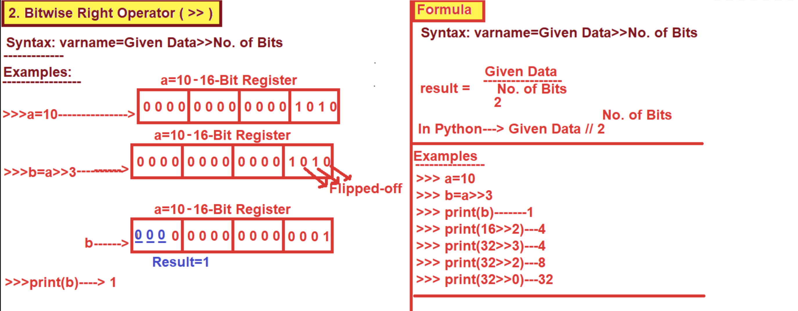

# 5. Bitwise Operators

=>The Purpose of Bitwise Operators is that "To Pefform Operations on Integer Data in the form of Bit by Bit."
=>The Bitwise Operators are applicable on Integer Values Only But not on floating point values bcoz Integer Values 
    provides Certanity where as floating point values does not provide Certanity.
=>The Execution Process of Bitwise Operators is shown Bellow.
		Step-1: Bitwise Operators Converts Integer Data into Binary Data.
		Step-2: Bitwise Operators Performs the Bitwise Operation on Binary Data in the form of Bit by Bit and 
		             generates Result and It is Internally Available in the form of Binary.
		Step-3: Since Python Programming Lang is High Level, PVM Displays the Result of Binary Operations
			    in the form of Decimal Number System (User Understandable format).
=>Since Bitwise Operators are Internally Performing the Operations in the Bit by Bit and They hence They named as 
    Bitwise Operators.
=>In Python Programming Language, We have 6 Types of Bitwise Operators. They Given in the following Table.
*************************************************************************************************************************************************
			SLNO		SYMBOL			MEANING
*************************************************************************************************************************************************
			1.			<<				Bitwise Left Shift Operator
			2.			>>				Bitwise Right Shift Operator
			3.			|				Bitwise OR Operator
			4.			&				Bitwise AND Operator
			5.			~				Bitwise Complement Operator
			6.			^				Bitwise XOR Operator
*************************************************************************************************************************************

### 1. Bitwise Left Shift Operator ( << )

Syntax:	varname = Given Number << No. of Bits
--------------------
Explanation:
--------------------
The Execution Process of Bitwise LeftShift Operator ( << ) is that "It Moves Number of Bits Towards Left Side By Adding Number of Zeros (Number of Zeros=Depending No. Of bits we Flipped-off) at Right Side.
-------------------------------
Examples
-------------------------------
>>> a=10
>>> b=a<<3
>>> print(b)------------80
>>> print(4<<3)-------32
>>> print(9<<2)-------36
>>> print(10<<0)-----10
>>> print(10.3<<2)-----------TypeError: unsupported operand type(s) for <<: 'float' and 'int'
>>> print(4<<-1)-------------ValueError: negative shift count


### 2. Bitwise RightShift Operator ( >> )

Syntax:     varname=Given Data >> No. of Bits
--------------------
Explanation:
--------------------
The Execution Process of Bitwise Right Shift Operator ( >> ) is that "It Moves Number of Bits Towards Right Side By Adding Number of Zeros (Number of Zeros=Depending No. Of bits we Flipped-off) at Left  Side.
-------------------------------
Examples
-------------------------------
>>> a=10
>>> b=a>>3
>>> print(b)---------1
>>> print(16>>2)---4
>>> print(32>>3)---4
>>> print(32>>2)---8
>>> print(32>>0)---32
>>> print(80.5<<4)----------TypeError: unsupported operand type(s) for <<: 'float' and 'int'
>>> print(4>>-2)-------------ValueError: negative shift count




### Bitwise OR Operator ( | )

=>Syntax:		Value1 | Value2
=>The Functionality of Bitwise OR Operator ( | ) is described with following truth table.
			----------------------------------------------------------------
				Value1	Value2	    Value1 | Value2
			----------------------------------------------------------------
				0		1				1
				1		0				1
				0		0				0			
				1		1				1	
			----------------------------------------------------------------
-----------------------
Example-1
------------------------
>>> 0 | 1----------------1
>>> 1 | 0----------------1
>>> 0 | 0----------------0
>>> 1 | 1----------------1
-----------------------------
Example-2
-----------------------------
a=10---------------->0000 1010
b=4----------------->0000  0100
------------------------------------------
c=a|b--------------->0000 1110
print(c)------------->14
------------------------------------------
>>> a=10
>>> b=10
>>> print(a|b)------10
------------------------------------------
Example-3
------------------------------------------
>>> s1={10,20,30}
>>> s2={15,10,25}
>>> s3=s1.union(s2)
>>> print(s3,type(s3))--------{20, 25, 10, 30, 15} <class 'set'>
------------------OR---------------
>>> s1={10,20,30}
>>> s2={15,10,25}
>>> s3=s1|s2  # Bitwise OR (|) Operator
>>> print(s3,type(s3))----------{20, 25, 10, 30, 15} <class 'set'>
>>> s1={1.2,2.3,4.5}
>>> s2={1.2,2.3,4.6}
>>> s3=s1|s2  # Bitwise OR (|) Operator
>>> print(s3,type(s3))----------{1.2, 2.3, 4.5, 4.6} <class 'set'>
>>> 1.2|2.3--------------------------TypeError: unsupported operand type(s) for |: 'float' and 'float'
----------------------------------------
>>> s1={"Python","Django"}
>>> s2={"C","HTML","C++"}
>>> s3=s1|s2   # Bitwise OR (|) Operator
>>> print(s3,type(s3))-----------{'C++', 'HTML', 'C', 'Python', 'Django'} <class 'set'>
>>> "Python"|"Java"-------------TypeError: unsupported operand type(s) for |: 'str' and 'str'


### Bitwise AND Operator (&)

=>Syntax:		Value1 & Value2
=>The Functionality of Bitwise AND Operator (&) is described with following truth table.
			----------------------------------------------------------------
				Value1	Value2	    Value1 & Value2
			----------------------------------------------------------------
				0		1				0
				1		0				0
				0		0				0
				1		1				1
			----------------------------------------------------------------
-----------------------
Example-1
------------------------
>>> 0 & 1----------------0
>>> 1 & 0----------------0
>>> 0 & 0----------------0
>>> 1 & 1----------------1
-----------------------------
Example-2
-----------------------------
>>>a=10-------------  0000 1010
>>>b=4--------------- 0000 0100
			-------------------------
>>>c=a&b----------  0000  0000
>>>print(c)---------0
-------------------------------------------------
>>>"Apple" & "mango"-------------TypeError: unsupported operand type(s) for &: 'str' and 'str'
>>> print(5&4)-------------------4
>>> print(4&5)-------------------4
---------------------------------------------------------
Example-3
---------------------------------------------------------
>>> s1={10,20,30}
>>> s2={15,20,35}
>>> s3=s1.intersection(s2)
>>> print(s3,type(s3))--------------{20} <class 'set'>
------------------OR------------------------		
>>> s1={10,20,30}
>>> s2={15,20,35}
>>> s3=s1&s2  # Bitwise & (AND) Operator
>>> print(s3,type(s3))---------{20} <class 'set'>
-------------------------------------
>>> s1={"Apple","mango","Kiwi"}
>>> s2={"Guava","Orango","mango"}
>>> s3=s1.intersection(s2)
>>> print(s3,type(s3))---------------{'mango'} <class 'set'>
-----------------------------------
>>> s1={"Apple","mango","Kiwi"}
>>> s2={"Guava","Orango","mango"}
>>> s3=s1&s2  # Bitwise & (AND) Operator
>>> print(s3,type(s3))-------------------{'mango'} <class 'set'>
------------------------------------------
>>> s1={1.2,2.3,4.5}
>>> s2={2.3,3.3,4.4}
>>> s3=s1.intersection(s2)
>>> print(s3,type(s3))---------{2.3} <class 'set'>
>>> s1={1.2,2.3,4.5}
>>> s2={2.3,3.3,4.4}
>>> s3=s1&s2  # Bitwise & (AND) Operator
>>> print(s3,type(s3))-----------{2.3} <class 'set'>
>>> 2.5&3.4-------------------------TypeError: unsupported operand type(s) for &: 'float' and 'float'
-----------------------------------------
>>> lst=[10,20,30,40]
>>> tpl=(10,15,25,56)
>>> lst&tpl---------------TypeError: unsupported operand type(s) for &: 'list' and 'tuple'


### Bitwise Complement Operator ( ~ )

=>Syntax:      varname= ~Given Number
=>The execution process of Bitwise Complement Operator ( ~ ) is that " It Inverts the given bits".
=>Inverting the bits is nothing but 1 becomes 0 and 0 becomes 1
=>The formula for Bitwise Complement Operator ( ~ ) is given bellow
				 ~Given Number =  - ( Given Number + 1)
----------------------------------------------------------------------------------------------------------------------------------------------------------------
Example1:
--------------------
>>> a=10
>>> print(~a)--------------      -11
>>> a=100
>>> print(~a)-----------------   -101
-----------------
>>> a=-123
>>> print(~a)-----------------  122
=============================================================================================
Q) Prove that  ~10 is -11
=============================================================================================
Proof : Given  ~10 =  -11
		Here -11 is the Opposite counter part(2's Complement )of 11
=>Given Number  10 and Whose Binary Part is   0000 1010
=> ~10 ----------------- ~(0000  1010) =  1111  0101 (Which is the Binary form of -11 which is the 2's complement of 11)
NOTE: All the Negative Numbers are 2's Complement of Their +Ve Numbers.
[Example:   10 whose Counter part is -10-----which is 2 's complement of 10]
-------------------------------------------------------
=>Here -11 is the Opposite counter part of 11 (2's complement of 11 )
=>All Negative Number stored in Main Memory in the form 2's Complement (2's complement= 1's complement+1)
-------------------------------------------------------
=>Here we Take 11 and whose Binary form is   0000   1011	
		(1's Complement of any Number= 1 becomes 0 and 0 becomes 1)
=>1's Complement of 11 is----------------------------1111  0100     
=>2's Complement of 11 is----------------------------1's Complement of 11 + 1
								=> 1111  0100 
								 =>0000 0001 Binary Addition Rules (0+0=0, 1+0=1, 0+1=1 , 1+1= 0 with carry 1 )
								-------------------------
								      1111 0101----which is 2's Complement of 11 --result is  -11
									------------------
=============================================================================================
Q) Prove that  ~16 is -17
=============================================================================================
Proof : Given  ~16 =  -17
		Here -17 is the Opposite counter part of 17
=>Given Number  16 and Whose Binary Part is   0001  0000
=> ~16 ----------------- ~(0001  0000) =   1110 1111 (Which is the Binary form of -17)
---------------------------------------------------------
=>Here -17 is the Opposite counter part of 17
=>All Negative Number stored in Main Memory in the form 2's Complement (2's complement= 1's complement+1)
-------------------------------------------------------
=>Here we Take 17 and whose Binary form is   0001 0001
	(1's Complement of any Number= 1 becomes 0 and 0 becomes 1)
=>1's Complement of 17 is----------------------------1110  1110
=>2's Complement of 17 is----------------------------1's Complement of 17 + 1
								=>	1110  1110
									0000  0001 Binary Addition Rules ( (0+0=0,1+0=1, 0+1=1,1+1= 0 with carry 1 )
									------------------
									1110	 1111  (Which is the Binary form of -17)
=============================================x=================================================
Q) Prove that  ~15 is -16
=============================================================================================
Proof : Given  ~15 =  -16
		Here -16 is the Opposite counter part of 16
=>Given Number  15 and Whose Binary Part is   0000  1111
=> ~15 ----------------- ~(0000  1111) =   1111 0000 (Which is the Binary form of -16)
---------------------------------------------------------
=>Here -16 is the Opposite counter part of 16
=>All Negative Number stored in Main Memory in the form 2's Complement (2's complement= 1's complement+1)
-------------------------------------------------------
=>Here we Take 16 and whose Binary form is   0001 0000
	(1's Complement of any Number= 1 becomes 0 and 0 becomes 1)
=>1's Complement of 16 is----------------------------1110  1111
=>2's Complement of 16 is----------------------------1's Complement of 16 + 1
								=>	1110  1111
									0000  0001    Binary Addition ((0+0=0, 1+0=1, 0+1=1 , 1+1= 0 with carry 1 )
									------------------
									1111	 0000  (Which is the Binary form of -16)


### Bitwise XOR Operator ( ^ )

=>Syntax:      Varname= Value1 ^ Value2
=>The Functionality of Bitwise XOR Operator ( ^ ) is expressed with the following Truth Table

			-----------------------------------------------------------------------------------------------
				Value1		Value2		Value1^Value2
			-----------------------------------------------------------------------------------------------
				1			0				1
				0			1				1
				1			1				0
				0			0				0
			-----------------------------------------------------------------------------------------------
Examples1
----------------------
>>> 1^0----------------1
>>> 0^1----------------1
>>> 1^1----------------0
>>> 0^0----------------0
---------------------------------
Examples2
---------------------------------
>>> print(2^3)--------1
>>> print(10^15)-----5
---------------------------------
Special Points
---------------------------------
>>> s1={10,20,30}
>>> s2={15,20,25}
>>> s3=s1.symmetric_difference(s2)
>>> print(s3,type(s3))----------------{10, 15, 25, 30} <class 'set'>
--------------
>>> s1={10,20,30}
>>> s2={15,20,25}
>>> s3=s1^s2  # Bitwise XOR Operator (^)
>>> print(s3,type(s3))------------{10, 15, 25, 30} <class 'set'>
>>> s1={"apple","mango","kiwi"}
>>> s2={"Sberry","mango","guava"}
>>> s3=s1^s2   # Bitwise XOR Operator (^)
>>> print(s3,type(s3))--------{'guava', 'apple', 'kiwi', 'Sberry'} <class 'set'>
>>> {1.2,2.3,3.4}^{1.2,2.3,4.5}--------{3.4, 4.5}
----------------------
>>> 1.2^2.3-----------------------TypeError: unsupported operand type(s) for ^: 'float' and 'float'
>>> "apple"^1.2----------------TypeError: unsupported operand type(s) for ^: 'str' and 'float'
---------------------------------------------------
Imp Logic----Swapping of Two Integer values
---------------------------------------------------
>>> a=3
>>> b=4
>>> print(a,b)---------3 4
>>> a=a^b
>>> b=a^b
>>> a=a^b
>>> print(a,b)--------4 3


### Special Points in Logical and Bitwise Operators

Most Special Points MNC ---and   
--------------------------------------------------------------------------------------------------------------------------------------------------------------
>>> 100 and 200---------------------------200
>>> 120 and -123------------------------- -123
>>> 0 and 120----------------------------- 0
>>> 120 and 234 and 450--------------- 450
>>> 120 and 10-10 and 40-------------- 0
>>> True and 300------------------------- 300
>>> False and False and 300----------False
>>> "Python" and "Java" and "Data Sci"---'Data Sci'
>>> 100 and 200-------------200
>>> 100 & 200---------------64
>>> 1.2 and 3.4--------------3.4
>>> 1.2 & 3.4-----------------TypeError: unsupported operand type(s) for &: 'float' and 'float'

>>> [10,20,30] & [1.2,3.4,5.6]------------------TypeError: unsupported operand type(s) for &: 'list' and 'list'
>>> set([10,20,30]) & set([1.2,3.4,5.6])------set()
>>> [10,20,30] and [1.2,3.4,5.6]--------------[1.2, 3.4, 5.6]
-------------------------------------------------------------------------------------------------------------------------------------------------------------
Most Special Points MNC --or
--------------------------------------------------------------------------------------------------------------------------------------------------------------
>>> 100 or 200---------------100
>>> 0 or 200------------------200
>>> 0 or 20 or 0------------20
>>> False or True or 20-----True
>>> "Python" or "Java" or " "------'Python'
>>> "" or "Python" or ""-------------'Python'
>>> 1.2 or 2.3-------------------1.2
>>> 1.2|2.3--------------------------TypeError: unsupported operand type(s) for |: 'float' and 'float'
--------------------------------------------------------------------------------------------------------------------------------------------------------------
Most Special Points MNC -------   and   or 
--------------------------------------------------------------------------------------------------------------------------------------------------------------
>>> 10 and 20 or 30-----------20
>>> 20 or 30 and 40-----------20
>>> 10 and 20 or 30 and 40 or 50----20
>>> "Easy" or "complex" and "Very Complex" or "Python" and "java"---'Easy'
--------------------------------------------------------------------------------------------------------------------------------------------------------------
Most Special Points MNC --and   or   not
--------------------------------------------------------------------------------------------------------------------------------------------------------------
>>> not "Easy" or "complex" and "Very Complex" or "Python" and "java"----'Very Complex'
>>> 100 and 200 or not "Python" or not "Java" and "Not"------------200
>>> not ("Good" and "Better" or "Best" or "Poor" and "Amazing")----False
>>> not ("Good" and "Better" or "Best" or "Poor" and "Amazing") and "False"---False
>>> 2 and (2>3) and 3-----------False


```
#BitwiseXORSwapping.py
a,b=int(input("Enter First Value:")),int(input("Enter Second Value:"))
print("="*50)
print("Original Value of a={}".format(a))
print("Original Value of b={}".format(b))
print("="*50)
#Swapping Logic
a=a^b
b=a^b
a=a^b
print("Swapped Value of a={}".format(a))
print("Swapped Value of b={}".format(b))
print("="*50)
```


