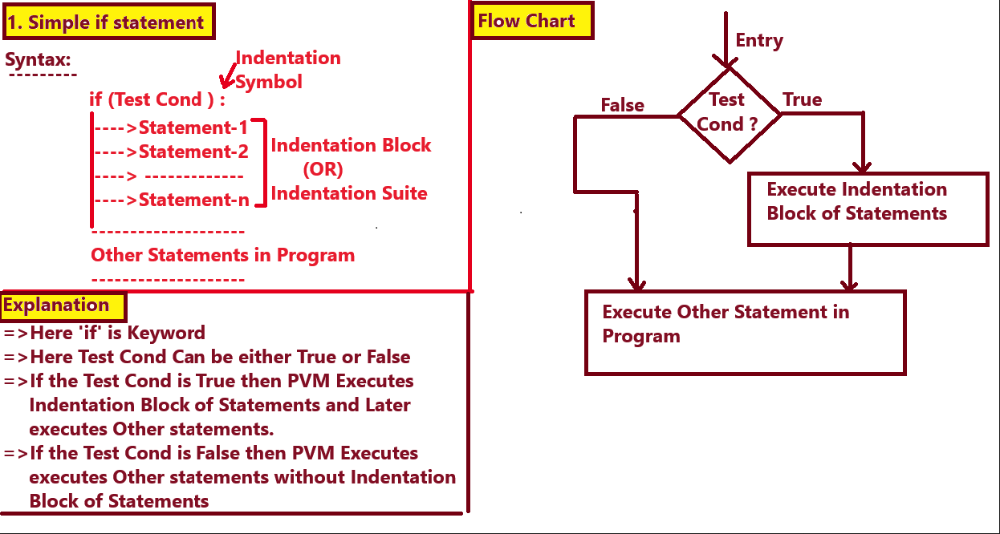

			
			
			
			
			
			
			========================================================
				Flow Control Statements in Python OR Control Structures
			========================================================
=>The purpose of Flow Control Statements in Python is that "To Perform Certain Operation (X-Operation or 
    Y-Operation) Only Once in the case True OR False OR Perform Certain Operation Repeatedly for Finite Number of Times until Test Condition becomes False."
=>In Python Programming, Flow Control Statements are categoried into 3 Types. They are

			I.  Condtional OR Selection OR Branching Statements
			II. Looping OR Iterative OR Repetative Statements
			III.Transfer Flow Statements 
=========================================================================================			
            
            
            
            
            
            
            ========================================================
						Flow Control Statements in Python
								OR
						Control Structures
			========================================================
Index
---------------
=>Purpose of Flow Control Statements in Python
=>Types of Flow Control Statements in Python
			**********************************************************************
			I. Condtional OR Selection OR Branching Statements
			**********************************************************************
				1. Simple if statement
				2. if..else statement
				3. if..elif..else statement
				4. match case statement
			  =>Programming Examples
			**********************************************************************
			II. Looping OR Iterative OR Repetative Statements
			**********************************************************************
				1. while loop  OR while..else Loop
				2. for loop	OR for..else loop
			  =>Programming Examples
		        **********************************************************************
			III. Transfer Flow Statements 
			**********************************************************************
				1. break
				2. continue
				3. pass
				4. return
			   =>Programing Examples
			**********************************************************************
=>Inner OR Nested Loops
	1) while loop in while loop
	2) for loop in for loop
	3) while loop in for loop
	4) for loop in while loop
=>Programming Examples
====================================================================================
NOTE:  Python Does not Support do..while loop of C, C++, Java, C#.net Lang
====================================================================================


			======================================================
				I.  Condtional OR Selection OR Branching Statements
			======================================================
=>The purpose of  Condtional OR Selection OR Branching Statements is that "To Perform Certain Operation only Once in the case either True or False".
=>In Otherwords, Condtional  Staments Executes either X-Operation in the case of True OR Y-Operation in the case of False Only Once.
=>In Python Programming, we have 4 Types of Condtional Statements. They are

				1. Simple if statement
				2. if..else statement
				3. if..elif..else statement
				4. match case statement (Python 3.10 Version Onwards)
===================================================================================


```
#SimpleIfStmtEx1.py
tkt = input("Do u have a Ticket(yes/no):")
if (tkt.upper()=="YES") :
    print("Enter into theater")
    print("watch the moviee")
    print("Understand Message and Enjoy")
print("Goto Home and Read Python Notes")
```

```
#SimpleIfStmtEx2.py
n=float(input("Enter a Number:"))
if(n>0):
    print("{} is +VE ".format(n))
if(n<0):
    print("{} is -VE".format(n))
if(n==0):
    print("{} is Zero".format(n))
print("Program Execution is complected")
```


