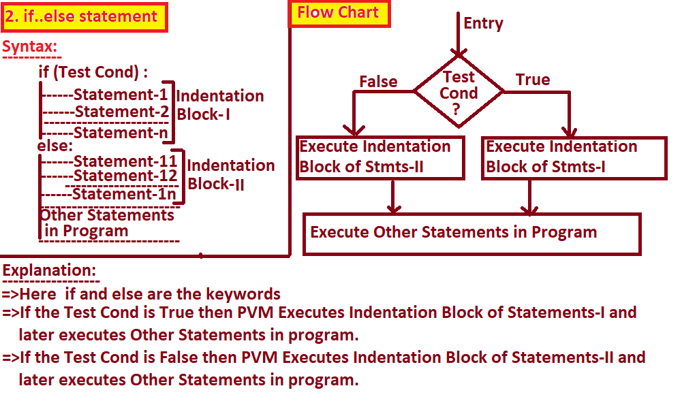
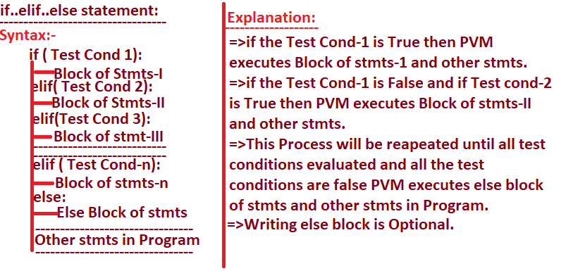
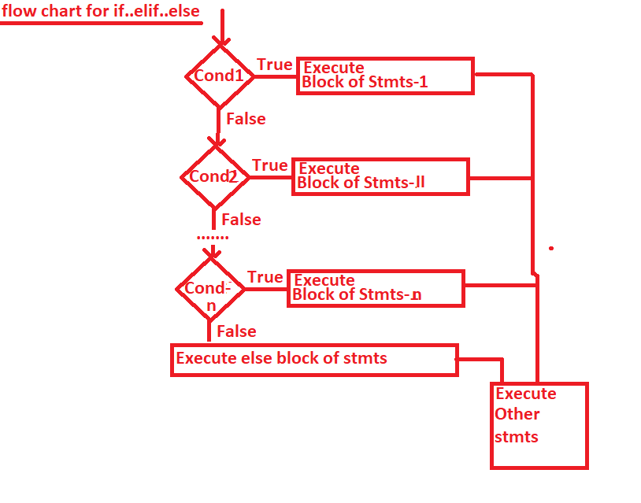

#DigitEx1.py
dictobj={0:"ZERO",1:"ONE",2:"TWO",3:"THREE",4:"FOUR",5:"FIVE",6:"SIX",7:"SEVEN",8:"EIGHT",9:"NINE",-1:"-ONE",-2:"-TWO",-3:"-THREE",-4:"-FOUR",-5:"-FIVE",-6:"-SIX",-7:"-SEVEN",-8:"-EIGHT",-9:"-NINE"}
d=int(input("Enter Any digit:"))
res=dictobj.get(d) if(dictobj.get(d)) else "It is +Ve Number" if d>9 else "It is -VE Number"
print("{} is {}".format(d,res))

#DigitEx2.py
dictobj={0:"ZERO",1:"ONE",2:"TWO",3:"THREE",4:"FOUR",5:"FIVE",6:"SIX",7:"SEVEN",8:"EIGHT",9:"NINE",-1:"-ONE",-2:"-TWO",-3:"-THREE",-4:"-FOUR",-5:"-FIVE",-6:"-SIX",-7:"-SEVEN",-8:"-EIGHT",-9:"-NINE"}
d=int(input("Enter Any digit:"))
print("{} is {}".format(d,dictobj.get(d) if(dictobj.get(d)) else "It is +Ve Number" if d>9 else "It is -VE Number"))

#IfElifElseStmtEx1.py
n=int(input("Enter Any Value:"))
if(n>0):
    print("{} s +VE".format(n))
elif(n<0):
    print("{} is -VE".format(n))
else:
    print("{} is ZERO".format(n))
print("Program Execution Completed")

#IfElifElseStmtEx2.py
d=int(input("Enter Any digit:")) # 0 1 2 .....9
if(d==0):
    print("{} is ZERO".format(d))
elif(d==-1):
    print("{} is -ONE".format(d))
elif(d==-2):
    print("{} is -TWO".format(d))
elif(d==-3):
    print("{} is -THREE".format(d))
elif(d==-4):
    print("{} is -FOUR".format(d))
elif(d==-5):
    print("{} is -FIVE".format(d))
elif(d==-6):
    print("{} is -SIX".format(d))
elif(d==-7):
    print("{} is -SEVEN".format(d))
elif(d==-8):
    print("{} is -EIGHT".format(d))
elif(d==-9):
    print("{} is -NINE".format(d))
elif(d==1):
    print("{} is ONE".format(d))
elif(d==2):
    print("{} is TWO".format(d))
elif(d==3):
    print("{} is THREE".format(d))
elif(d==4):
    print("{} is FOUR".format(d))
elif(d==5):
    print("{} is FIVE".format(d))
elif(d==6):
    print("{} is SIX".format(d))
elif(d==7):
    print("{} is SEVEN".format(d))
elif(d==8):
    print("{} is EIGHT".format(d))
elif(d==9):
    print("{} is NINE".format(d))
elif(d>9):
    print("{} is a +NUMBER".format(d))
else:
    print("{} is a  -VE NUMBER".format(d))
print("Program Execution Completed")

#IfElseStatementEx1.py
value=input("Enter Any Value/word:")
if(value==value[::-1]):
    print("{} is Palindrome".format(value))
else:
    print("{} is Not Palindrome".format(value))
print("Program Execution Compelted")

#IfElseStatementEx2.py
value=int(input("Enter Any Value:"))
if(value>0):
    print("{} is +VE".format(value))
else:
    if(value<0):
        print("{} is -VE".format(value))
    else:
        print("{} is ZERO".format(value))
    print("Other stmts in Inner if..else statement")
print("Other stmts in Outer if..else statement")

#IfElseStatementEx3.py
d=int(input("Enter Any digit:")) # 0 1 2 .....9
if(d==0):
    print("{} is ZERO".format(d))
else:
    if(d==1):
        print("{} is ONE".format(d))
    else:
        if (d == 2):
            print("{} is TWO".format(d))
        else:
            if (d == 3):
                print("{} is THREE".format(d))
            else:
                if (d == 4):
                    print("{} is FOUR".format(d))
                else:
                    if (d == 5):
                        print("{} is FIVE".format(d))
                    else:
                        if (d == 6):
                            print("{} is SIX".format(d))
                        else:
                            if (d == 7):
                                print("{} is SEVEN".format(d))
                            else:
                                if (d == 8):
                                    print("{} is EIGHT".format(d))
                                else:
                                    if (d == 9):
                                      print("{} is ONE".format(d))
print("Program Execution Completed")

#SimpleIfStmtEx1.py
tkt = input("Do u have a Ticket(yes/no):")
if (tkt.upper()=="YES") :
    print("Enter into theater")
    print("watch the moviee")
    print("Understand Message and Enjoy")
print("Goto Home and Read Python Notes")

#SimpleIfStmtEx2.py
n=float(input("Enter a Number:"))
if(n>0):
    print("{} is +VE ".format(n))
if(n<0):
    print("{} is -VE".format(n))
if(n==0):
    print("{} is Zero".format(n))
print("Program Execution is complected")

#SimpleIfStmtEx3.py
value=input("Enter Any Value/Word:") # PYTHON      MOM
if(value==value[::-1]):
    print("{} is Palindrome".format(value))
if(value!=value[::-1]):
    print("{} is Not Palindrome".format(value))
print("Program Execution Completes")

#SimpleIfStmtEx4.py
value=input("Enter Any Word:")#Python
if("a" in value) or ("e" in value) or ("i" in value) or ("o" in value) or ("u" in value):
    print("{} is Vowel Word".format(value))
if not(("a" in  value) or ("e" in value) or ("i" in value) or ("o" in value) or ("u" in value)):
    print("{} is Not a Vowel Word".format(value))

#SimpleIfStmtEx5.py
d=int(input("Enter Any digit:")) # 0 1 2 .....9
if(d==0):
    print("{} is ZERO".format(d))
if(d==1):
    print("{} is ONE".format(d))
if(d==2):
    print("{} is TWO".format(d))
if(d==3):
    print("{} is THREE".format(d))
if(d==4):
    print("{} is FOUR".format(d))
if(d==5):
    print("{} is FIVE".format(d))
if(d==6):
    print("{} is SIX".format(d))
if(d==7):
    print("{} is SEVEN".format(d))
if(d==9):
    print("{} is NINE".format(d))
if(d==8):
    print("{} is EIGHT".format(d))
print("Program Execution Completed")

