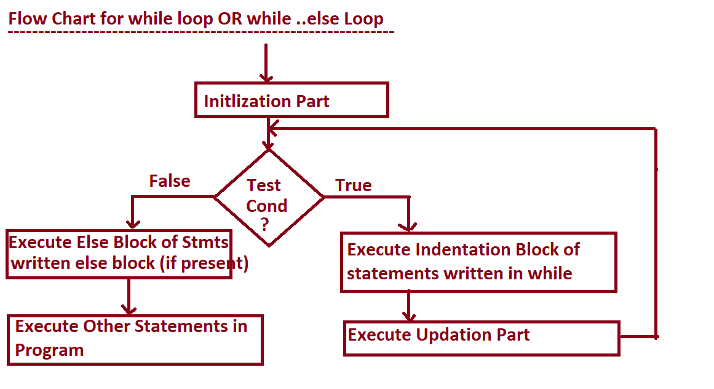
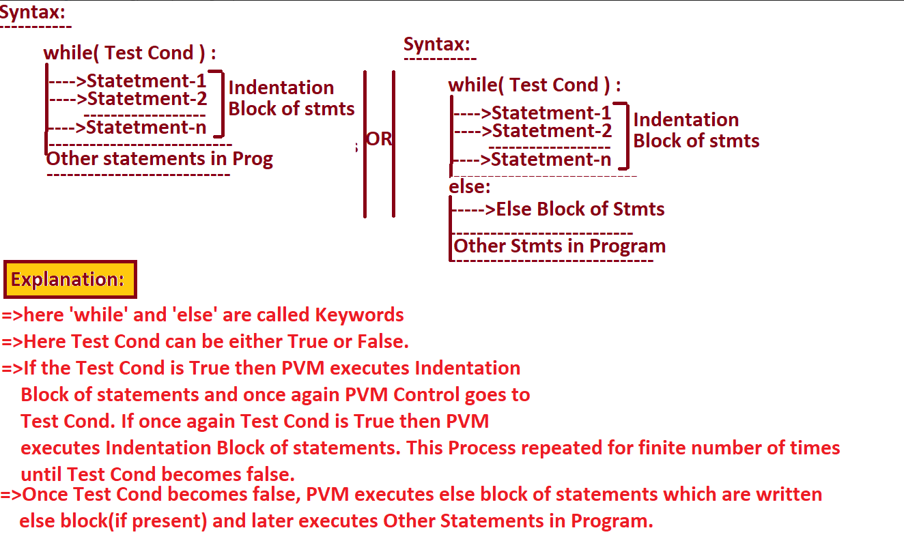

		============================================================
				Looping OR Iterative OR Repetative Statements
		============================================================
=>The purpose of Looping OR Iterative OR Repetative Statements is that "To perform Certain Operation /Task Repeatedly OR Iteratively for Finite Number of Times until Test Condition becomes False."
=>In Python Programming, we have  TWO Looping OR Iterative OR Repetative Statements. They are

			1. while loop  OR while...else loop
			2. for loop OR for...else loop
=>While we are dealing with Looping OR Iterative OR Repetative Statements, we must ensure THREE important Factors. They are
			1. Initlization Part ( Where to Start )
			2. Conditional Part ( How long to contiue and Where to Stop )
			3. Updation Part ( Incrementation OR Decrementation )

Req  to generate the series of Values

			1					i=1
			2					while(i<=10):
			3						print(i)
			4						i=i+1
			5
			6
			7
			8
			9
			10

#Program for  generating 1 to N Numbers where n is +ve
#WhileLoopEx1.py
n=int(input("Enter How Many Numbers u want to generate:"))
if(n<=0):
    print("{} is Invalid Input".format(n))
else:
    i=1 # Initlization Part
    while(i<=n): # Test Condition
        print(i)
        i+=1 # Updation Part
    else:
        print("i am from else part of while loop ")
    print("Other stmt in while..else loop")
print("Other stmts in Program")

#Program for  generating  N  to 1 Numbers where n is +ve
#WhileLoopEx2.py
n=int(input("Enter How Many Numbers u want to generate:"))
if(n<=0):
    print("{} is Invalid Input".format(n))
else:
    print("-" * 40)
    print("Number within:{}".format(n))
    print("-" * 40)
    i=n
    while(i>=1):
        print("\t\t{}".format(i))
        i=i-1
    else:
        print("-"*40)

#Program for Generating Mul Table for n where n is +ve
#WhileLoopEx3.py
n=int(input("Enter a Number for generating Mul Table:"))
if(n<=0):
    print("{} is Invalid Input".format(n))
else:
    print("="*50)
    print("Mul Table for :{}".format(n))
    print("=" * 50)
    i=1
    while(i<=10):
        print("\t{} x {}={}".format(n,i,n*i))
        i=i+1
    else:
        print("=" * 50)

#WhileLoopEx4.py
word=input("Enter Any Word:") # PYTHON
i=0
while(i<len(word)):
    print(word[i])
    i=i+1

