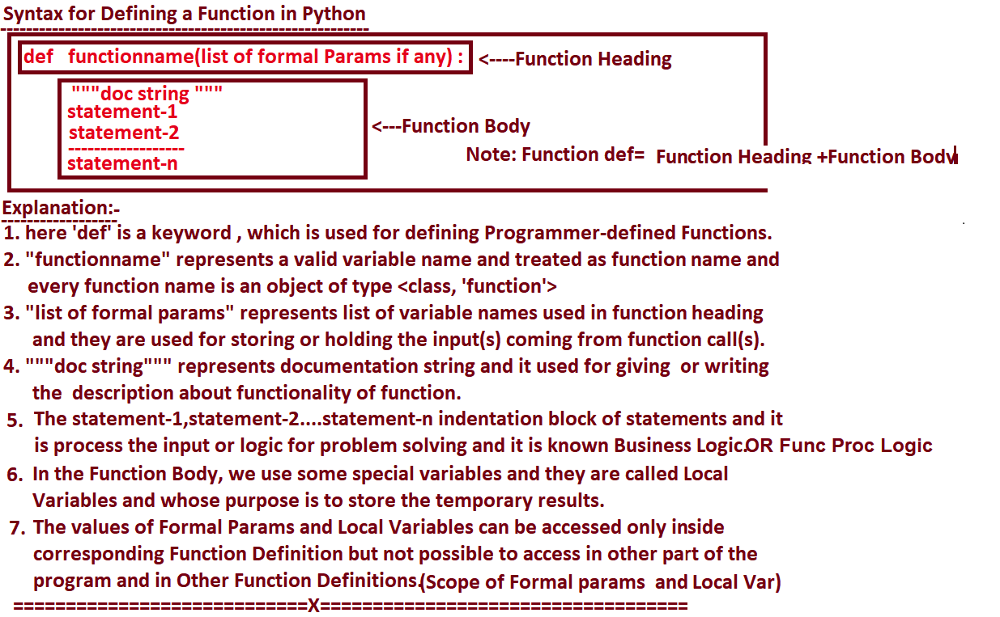

			=========================================================
							Types of Languages
				=========================================================
=>In Industry , we have Two Types of Programming Langauges. They are

			1. Un-Structured Programming Languages.
			2. Structured Programming Languages.
-----------------------------------------------------------------------------------------------------------------------------------------------------------
1. Un-Structured Programming Languages
-----------------------------------------------------------------------------------------------------------------------------------------------------------
=>The Un-Structured Programming Languages DOES NOT CONTAIN FUNCTIONs Concept. So that whose related Applications has the Following Limitations.

		1. Application Development time is More
		2. Application Memory Space is More
		3. Application Execution Time is More
		4. Application Performnace is Degraded
		5. Redundency(Duplication or Replication)  of the Code is More
Examples: GW-BASIC
-----------------------------------------------------------------------------------------------------------------------------------------------------------
2. Structured Programming Languages.
-----------------------------------------------------------------------------------------------------------------------------------------------------------
=>The Structured Programming Languages  CONTAINS FUNCTIONs Concept. So that whose related Applications has the Following Advatnages.
		1. Application Development time is Less.
		2. Application Memory Space is Less.
		3. Application Execution Time is Less.
		4. Application Performance is Enhanced (Improved)
		5. Redundency(Duplication or Replication)  of the Code is Minimized.
Examples:  C, C++, Java, C#.net, PYTHON...etc

		===========================================================
					Functions in Python
		===========================================================
=>The purpose of Functions is that " To Perform Certain Operation /Task and Provides Code Re-Usability".
=>The Advantages of Functions in any languages are
			1. Application Development time is Less
			2. Application Memory Space is Less
			3. Application Execution Time is Less
			4. Application Performance  is Enhanced
			5. Redundency of the Code is Minimized
--------------------------------------------------------------------------------------------------------------------------------
Definitions of Function
--------------------------------------------------------------------------------------------------------------------------------
=>Sub Program of Main Program is Called Function.
			(OR).
=>A Part of main program is Called Function.
--------------------------------------------------------------------------------------------------------------------------------
Parts of Functions
--------------------------------------------------------------------------------------------------------------------------------
=>At the time Developing functions in real time, we must ensure that, there must exist 2 Parts. they are
		1. Function Definition
		2. Function Calls
=>Every Function Definition Exists Only Once
=>Every Function call must contains a Function Defintion Otherwise we get NameError.
=>Function Definition will execute when we call by using function calls OR Without  calling the 
    Function by using Function Calls, PVM will not execute Function Definition.
--------------------------------------------------------------------------------------------------------------------------------
Phases in Functions
--------------------------------------------------------------------------------------------------------------------------------
=>At the time Defining the functions, the Programmer must ensure that there must exist the following Phases.
		1. Every Function Must take INPUT
		2. Every Function Must PROCESS the Input
		3. Every Function Must give OUTPUT or RESULT